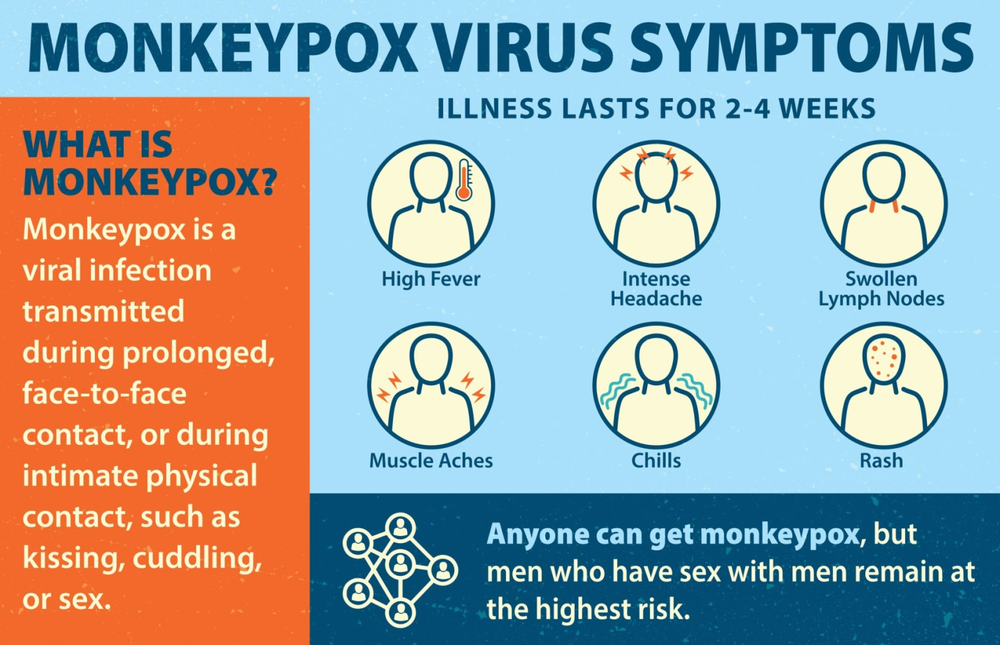

# Impact-of-Traveling-on-Monkeypox-Pandemic-in-Europe

---
## Introduction
This study aims to analyze the impact of travel history on the Monkey Pox pandemic in Europe.
On May 6, 2022, a monkeypox outbreak was confirmed. It started with a British citizen who on April 29, 2022, after visiting Nigeria(where the disease is endemic), displayed symptoms that were consistent with monkeypox. On May 4, the resident returned to the UK, resulting in the outbreak’s index case in that nation.
**This project gives great insight into the effect of travel history on an endemic area to the spread of the virus in Europe.**

## Problem Statement
1) How many Countries were affected by the Monkey Pox Pandemic?
2) How many cases were confirmed in all the regions of the world?
3) Which Region had the highest number of confirmed Cases?
4) How many Monkey Pox cases were confirmed in Europe?
5) How Many European countries had more than 200 confirmed Cases?
6) Which European country had the highest number of Monkeypox Confirmed cases?
7) What is the impact of Travel history on the Pandemic?

	## Project Design
This dataset was taken from the Kaggle site which contains data from three different sets.
To avoid false analysis, Google Sheets were used to clean the data, removing all empty cells and duplicates.

### pivot table

Visualization was done correctly using Tableau.
The report comproses of two pages:

- World monkeypox prevalence
- Impact of traveling on monkeypox pandemic in Europe
  
You can interact with the report [here](https://public.tableau.com/views/ImpactofTravelingonMonkeypoxPandemicinEurope/Dashboard1?:language=en-US&:display_count=n&:origin=viz_share_link)

